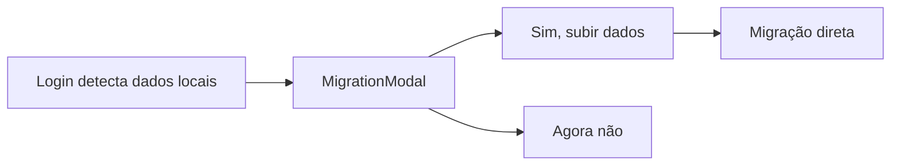
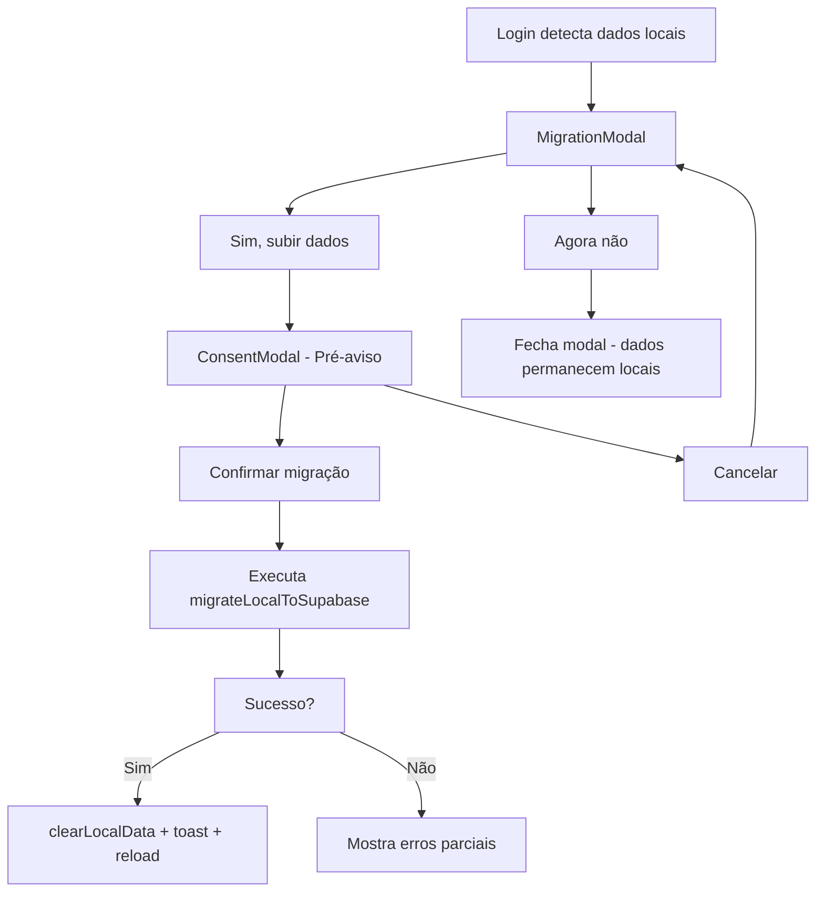

# Plano: Consent Flow (LGPD) para Migração de Dados

## Contexto

O fluxo atual de migração não é explícito sobre quais dados serão enviados para a nuvem. A LGPD exige que o usuário tenha clareza sobre o que está sendo transferido antes de consentir.

---

## Fluxo Atual



**Problema:** O usuário não sabe exatamente o que está sendo enviado.

---

## Fluxo Proposto



---

## Componentes

### 1. ConsentModal (NOVO)

Modal de pré-aviso que lista explicitamente os dados que serão enviados.

**Props:**
```typescript
interface ConsentModalProps {
  onConfirm: () => void
  onCancel: () => void
  dataSummary: {
    habits: number
    history: number
    transactions: number
    goals: number
    readings: number
    projects: number
    journal: number
  }
}
```

**Conteúdo:**
```
┌─────────────────────────────────────┐
│            📋 O que será enviado    │
│                                     │
│  Antes de continuar, saiba exatamente│
│  o que será transferido para a nuvem:│
│                                     │
│  ✓ Hábitos e histórico (X itens)    │
│  ✓ Dados financeiros (X transações) │
│  ✓ Entradas do diário (X entradas)  │
│  ✓ Carreira e projetos (X itens)    │
│                                     │
│  Seus dados ficam protegidos na sua │
│  conta e nunca são compartilhados.  │
│  Você pode apagar tudo a qualquer   │
│  momento.                           │
│                                     │
│  ┌─────────────────────────────┐    │
│  │   Confirmar migração        │    │
│  └─────────────────────────────┘    │
│  ┌─────────────────────────────┐    │
│  │   Cancelar                  │    │
│  └─────────────────────────────┘    │
└─────────────────────────────────────┘
```

### 2. MigrationModal (MODIFICADO)

Adiciona etapa de consentimento antes de executar a migração.

**Mudanças:**
- Adiciona estado `showConsent`
- `handlePrimary` abre ConsentModal em vez de migrar direto
- Nova função `handleConfirmedMigration` executa a migração real

---

## Arquivos a Modificar

| Arquivo | Ação |
|---------|------|
| `src/components/ConsentModal.jsx` | **CRIAR** - Novo componente |
| `src/components/ConsentModal.module.css` | **CRIAR** - Estilos |
| `src/components/MigrationModal.jsx` | **MODIFICAR** - Integrar consent |
| `src/services/syncService.js` | **MODIFICAR** - Adicionar `getDataSummary()` |

---

## Implementação Detalhada

### Passo 1: Criar função `getDataSummary()`

```javascript
// src/services/syncService.js

export function getDataSummary() {
  return {
    habits: loadStorage('nex_habits', []).length,
    history: Object.keys(loadStorage('nex_history', {})).length,
    transactions: loadStorage('nex_fin_transactions', []).length,
    goals: loadStorage('nex_fin_goals', []).length,
    readings: loadStorage('nex_career_readings', []).length,
    projects: loadStorage('nex_projects', []).length + 
              loadStorage('nex_career_projects', []).length,
    journal: loadStorage('nex_journal', []).length,
  }
}
```

### Passo 2: Criar ConsentModal

```jsx
// src/components/ConsentModal.jsx

import { PiCheckBold, PiShieldCheckBold } from 'react-icons/pi'
import styles from './ConsentModal.module.css'

export function ConsentModal({ onConfirm, onCancel, dataSummary }) {
  const items = [
    { label: 'Hábitos e histórico', count: dataSummary.habits + dataSummary.history },
    { label: 'Dados financeiros', count: dataSummary.transactions + dataSummary.goals },
    { label: 'Entradas do diário', count: dataSummary.journal },
    { label: 'Carreira e projetos', count: dataSummary.readings + dataSummary.projects },
  ].filter(i => i.count > 0)

  return (
    <div className={styles.overlay}>
      <div className={styles.modal}>
        <div className={styles.icon}>
          <PiShieldCheckBold size={32} />
        </div>
        
        <h2 className={styles.title}>O que será enviado</h2>
        
        <p className={styles.desc}>
          Antes de continuar, saiba exatamente o que será transferido para a nuvem:
        </p>
        
        <ul className={styles.list}>
          {items.map(item => (
            <li key={item.label}>
              <PiCheckBold size={14} />
              <span>{item.label}</span>
              <span className={styles.count}>{item.count}</span>
            </li>
          ))}
        </ul>
        
        <p className={styles.note}>
          Seus dados ficam protegidos na sua conta e nunca são compartilhados.
          Você pode apagar tudo a qualquer momento nas configurações.
        </p>
        
        <div className={styles.actions}>
          <button className="btn btn-primary" onClick={onConfirm}>
            Confirmar migração
          </button>
          <button className="btn" onClick={onCancel}>
            Cancelar
          </button>
        </div>
      </div>
    </div>
  )
}
```

### Passo 3: Modificar MigrationModal

```jsx
// src/components/MigrationModal.jsx - Mudanças principais

import { useState } from 'react'
import { ConsentModal } from './ConsentModal'
import { getDataSummary } from '../services/syncService'

export function MigrationModal({ userId, onDone, mode = 'migrate' }) {
  const [loading, setLoading] = useState(false)
  const [showConsent, setShowConsent] = useState(false)
  const [dataSummary] = useState(() => getDataSummary())
  
  // ... código existente ...

  // NOVO: Abre consent modal em vez de migrar direto
  function handlePrimary() {
    if (isPaywall) {
      localStorage.removeItem('ior_auth_skipped')
      window.location.reload()
      return
    }
    setShowConsent(true)
  }

  // NOVO: Executa migração após consentimento
  async function handleConfirmedMigration() {
    setShowConsent(false)
    setLoading(true)
    // ... código de migração existente ...
  }

  return (
    <>
      {/* Modal existente */}
      <div className={styles.overlay}>
        {/* ... conteúdo existente ... */}
      </div>
      
      {/* NOVO: Consent modal */}
      {showConsent && (
        <ConsentModal
          dataSummary={dataSummary}
          onConfirm={handleConfirmedMigration}
          onCancel={() => setShowConsent(false)}
        />
      )}
    </>
  )
}
```

---

## Critérios de Aceitação

- [ ] Ao clicar em "Sim, subir dados", exibe ConsentModal
- [ ] ConsentModal lista todos os tipos de dados com contagens
- [ ] Usuário pode cancelar e voltar ao modal anterior
- [ ] Ao confirmar, migração prossegue normalmente
- [ ] Texto está claro e em português
- [ ] Layout responsivo para mobile

---

## Testes Manuais

1. **Cenário 1: Migração completa**
   - Criar dados locais (hábitos, transações, diário)
   - Fazer login
   - Clicar em "Sim, subir dados"
   - Verificar se ConsentModal exibe contagens corretas
   - Confirmar migração
   - Verificar se dados aparecem no Supabase

2. **Cenário 2: Cancelamento**
   - Abrir ConsentModal
   - Clicar em "Cancelar"
   - Verificar se volta para MigrationModal
   - Verificar se dados locais permanecem intactos

3. **Cenário 3: Dados parciais**
   - Criar apenas hábitos (sem diário, sem finanças)
   - Verificar se ConsentModal mostra apenas itens com dados

---

## Próximos Passos (fora deste escopo)

Após implementar o consent flow, os próximos itens da lista são:

1. Botão de apagar dados (local e nuvem)
2. Migração bloqueada no Free, disponível no Pro
3. Fluxo de saída para usuários sem conta
4. Consciência de permissões antes de migrar

---

*Plano criado em março de 2026*
