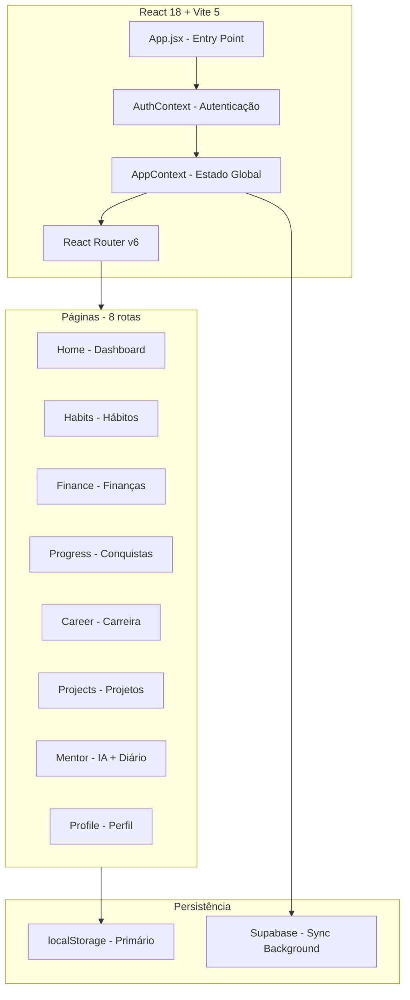
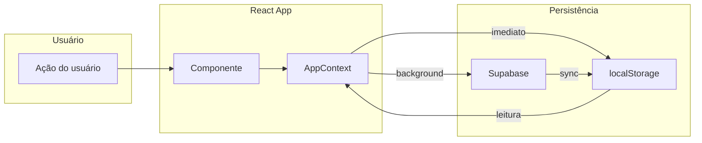

# Estrutura do Projeto IoversoRoot

## Visão Geral

**IoversoRoot** (ou **Rootio**) é um aplicativo de desenvolvimento pessoal **offline-first** que combina rastreamento de hábitos, finanças, carreira e mentoramento com IA. Tudo armazenado localmente no `localStorage`, com sincronização opcional via Supabase.

---

## Arquitetura de Alto Nível



---

## Stack Técnica

| Camada | Tecnologia |
|--------|------------|
| **Framework** | React 18.2 |
| **Build** | Vite 5.1 |
| **Roteamento** | React Router 6.22 |
| **Estado Global** | Context API + useState |
| **Persistência** | localStorage + Supabase |
| **Estilo** | CSS Modules + variáveis CSS |
| **Ícones** | Phosphor Icons (react-icons/pi) |
| **PWA** | Service Worker + manifest.json |
| **IA** | Claude API (Anthropic) |

---

## Estrutura de Diretórios

```
ioversoroot/
├── public/                    # Assets estáticos
│   ├── manifest.json          # PWA manifest
│   ├── sw.js                  # Service Worker
│   ├── offline.html           # Página offline
│   └── icons/                 # Ícones PWA
│
├── src/
│   ├── App.jsx                # Entry point + rotas
│   ├── main.jsx               # Bootstrap React
│   │
│   ├── context/               # Estado global
│   │   ├── AppContext.jsx     # habits, history, theme, sound
│   │   └── AuthContext.jsx    # autenticação Supabase
│   │
│   ├── hooks/                 # Hooks customizados
│   │   ├── useHabits.js       # stats de hábitos
│   │   ├── useStats.js        # streak, heatmap
│   │   ├── useSound.js        # Web Audio API
│   │   ├── useNav.js          # navegação
│   │   └── usePlan.js         # plano free/pro
│   │
│   ├── services/              # Lógica de negócio
│   │   ├── storage.js         # localStorage helpers
│   │   ├── themes.js          # 8 temas visuais
│   │   ├── levels.js          # sistema de níveis
│   │   ├── supabase.js        # cliente Supabase
│   │   ├── syncService.js     # sincronização
│   │   ├── plan.js            # limites free/pro
│   │   └── claudeAPI.js       # integração IA
│   │
│   ├── components/            # Componentes reutilizáveis
│   │   ├── Header.jsx         # topo com logo + streak
│   │   ├── BottomNav.jsx      # navegação inferior
│   │   ├── SideNav.jsx        # menu lateral
│   │   ├── Toast.jsx          # notificações
│   │   ├── SplashScreen.jsx   # animação inicial
│   │   ├── CheckBox.jsx       # checkbox acessível
│   │   ├── LegalModal.jsx     # termos/privacidade
│   │   ├── MigrationModal.jsx # migração de dados
│   │   ├── ProGate.jsx        # paywall pro
│   │   ├── AITeaser.jsx       # teaser de IA
│   │   └── OfflineBanner.jsx  # aviso offline
│   │
│   ├── pages/                 # Páginas da aplicação
│   │   ├── Home.jsx           # dashboard principal
│   │   ├── Habits.jsx         # CRUD de hábitos
│   │   ├── Finance.jsx        # receitas/despesas
│   │   ├── Progress.jsx       # conquistas + stats
│   │   ├── Career.jsx         # leituras + metas
│   │   ├── Projects.jsx       # projetos de vida
│   │   ├── Mentor.jsx         # chat IA + diário
│   │   ├── Profile.jsx        # configurações
│   │   ├── Login.jsx          # autenticação
│   │   ├── Stats.jsx          # legado
│   │   └── Rewards.jsx        # legado
│   │
│   └── styles/
│       └── global.css         # variáveis CSS + reset
│
├── index.html
├── vite.config.js
├── package.json
├── README.md
└── IOVERSOROOT_ARCHITECTURE.md
```

---

## Fluxo de Dados



### Padrão Offline-First

1. **Escrita**: Salva em `localStorage` imediatamente, sincroniza com Supabase em background
2. **Leitura**: Sempre lê do `localStorage` primeiro
3. **Login**: Se não houver dados locais, carrega do Supabase

---

## Schema de Dados (localStorage)

Todos os dados são prefixados com `nex_`:

| Chave | Tipo | Descrição |
|-------|------|-----------|
| `nex_habits` | Habit[] | Lista de hábitos |
| `nex_history` | Record<string, DayRecord> | Histórico diário |
| `nex_fin_transactions` | Transaction[] | Transações financeiras |
| `nex_fin_goals` | Goal[] | Metas financeiras |
| `nex_fin_emergency` | {target, current} | Fundo de emergência |
| `nex_career_readings` | Reading[] | Livros/cursos/artigos |
| `nex_career_goals` | CareerGoal[] | Metas de carreira |
| `nex_career_projects` | CareerProject[] | Projetos de carreira |
| `nex_projects` | Project[] | Projetos de vida |
| `nex_journal` | JournalEntry[] | Diário pessoal |
| `nex_theme` | string | Tema ativo |
| `nex_sound` | boolean | Som ligado/desligado |
| `nex_shop_owned` | string[] | Itens desbloqueados |
| `nex_username` | string | Nome do usuário |
| `nex_avatar` | string | Emoji do avatar |

---

## Sistema de Níveis

6 níveis baseados em pontos acumulados (io):

| Nível | Pontos Mínimos | Mantra |
|-------|----------------|--------|
| **Impulso** | 0 | Algo começou. |
| **Rastro** | 500 | Você está deixando marca. |
| **Ritmo** | 4.000 | Previsível. Confiável. |
| **Forma** | 15.000 | Isso é parte de você. |
| **Essência** | 50.000 | Difícil separar da pessoa. |
| **Raiz** | 200.000 | Impossível arrancar. |

---

## Rotas da Aplicação

| Rota | Página | Requisito |
|------|--------|-----------|
| `/` | Home | - |
| `/habits` | Hábitos | - |
| `/finance` | Finanças | - |
| `/progress` | Progresso | Desbloquear na loja |
| `/mentor` | Mentor | Desbloquear na loja |
| `/career` | Carreira | Desbloquear na loja |
| `/projects` | Projetos | Desbloquear na loja |
| `/profile` | Perfil | - |

---

## Componentes Principais

### Navegação

- **Header**: Logo + streak pill
- **BottomNav**: 4 fixos + até 3 desbloqueáveis
- **SideNav**: Menu lateral completo

### Funcionalidades

- **SplashScreen**: Animação de entrada (~1.35s)
- **Toast**: Notificações auto-dismiss (2.5s)
- **LegalModal**: Termos, privacidade, cookies
- **MigrationModal**: Migração de dados local → nuvem
- **ProGate**: Paywall para features Pro

---

## Temas Disponíveis

8 temas visuais com variáveis CSS:

1. **light** (padrão)
2. **dark**
3. **midnight**
4. **forest**
5. **sakura**
6. **desert**
7. **dracula**
8. **nord**

---

## Próximos Passos

Se você quiser explorar mais a fundo:

1. **Funcionalidade específica**: Posso detalhar qualquer página ou componente
2. **Fluxo de dados**: Posso explicar como funciona a sincronização
3. **Sistema de pontos**: Posso detalhar o cálculo de níveis
4. **Integração IA**: Posso explicar o Mentor e Claude API

---

*Documento gerado em março de 2026*
