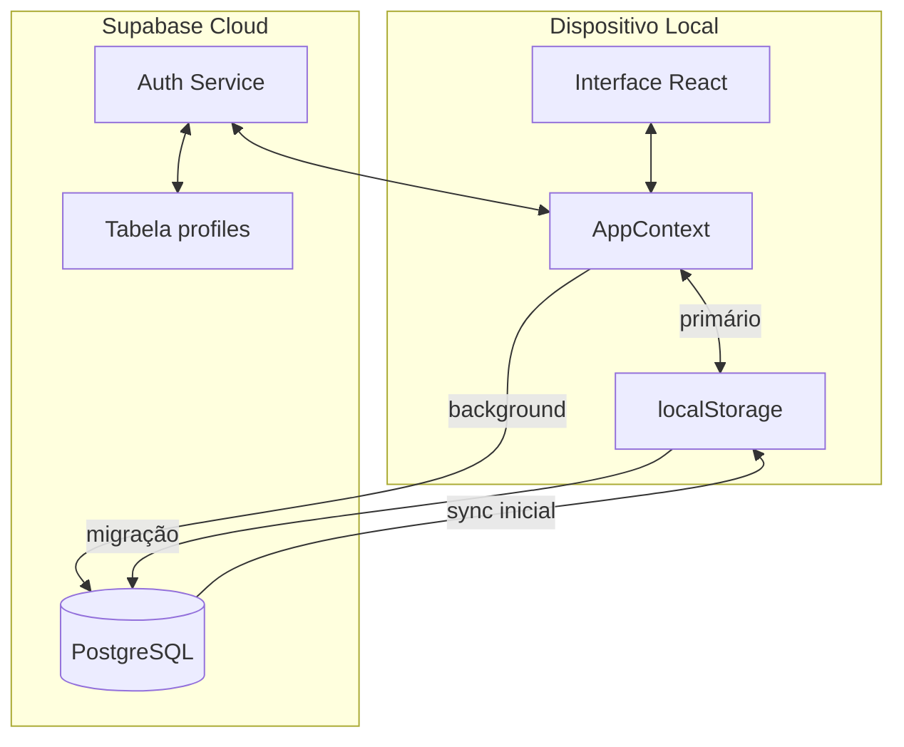
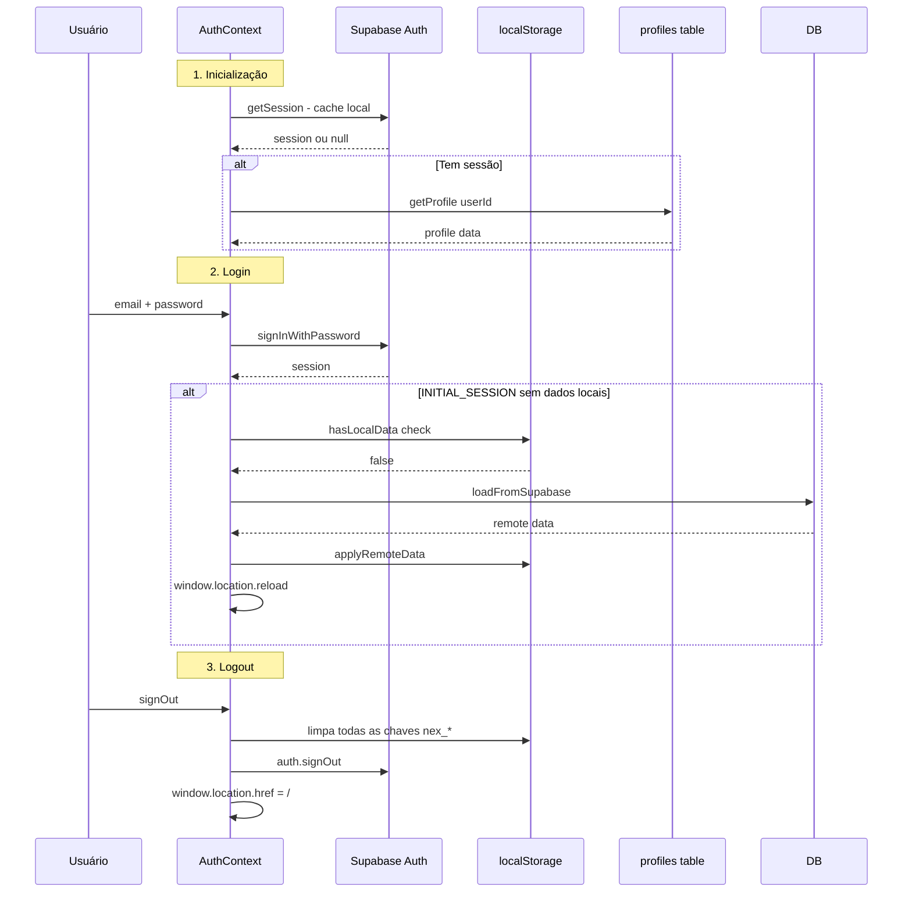
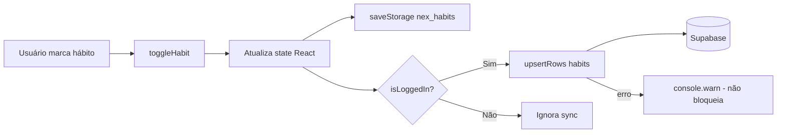
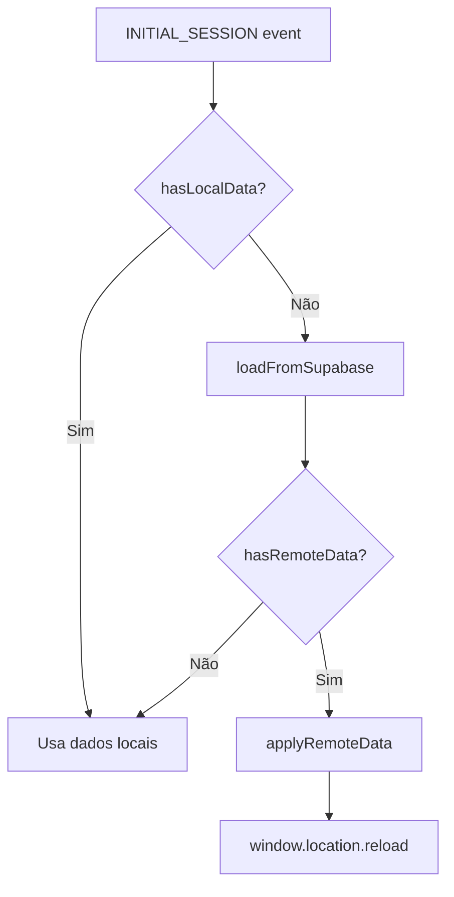
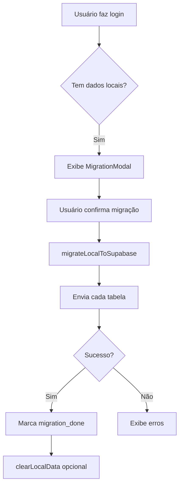

# Fluxo de Dados e Sincronização - IoversoRoot

## Visão Geral

O IoversoRoot segue uma arquitetura **offline-first**, onde o `localStorage` é a fonte primária de dados e o Supabase serve como backup/sincronização em background.

---

## Arquitetura de Sincronização



---

## Fluxo de Autenticação



---

## Fluxo de Escrita - Hábitos



### Código de Exemplo - AppContext

```javascript
// Escrita imediata no localStorage, sync em background
const toggleHabit = useCallback((id) => {
  setHabits(prev => {
    const updated = prev.map(h => 
      h.id === id ? { ...h, done: !h.done } : h
    )
    
    // 1. Persistência local imediata
    saveStorage('nex_habits', updated)
    
    // 2. Sync background (não bloqueia)
    if (isLoggedIn && userId) {
      upsertRows('habits', updated.map(h => ({ ...h, user_id: userId })))
        .catch(err => console.warn('Sync falhou:', err))
    }
    
    return updated
  })
}, [isLoggedIn, userId])
```

---

## Fluxo de Leitura - Login



### Condições de Sync Inicial

O sync inicial só acontece quando:
1. Evento é `INITIAL_SESSION` (não `SIGNED_IN`)
2. `hasLocalData()` retorna `false`
3. Há dados remotos no Supabase

Isso previne:
- Loop infinito de reload
- Sobrescrita de dados locais por acidente

---

## Tabelas Sincronizadas

| Tabela Supabase | Chave localStorage | Tipo |
|-----------------|-------------------|------|
| `habits` | `nex_habits` | Array |
| `habit_history` | `nex_history` | Objeto por data |
| `transactions` | `nex_fin_transactions` | Array |
| `financial_goals` | `nex_fin_goals` | Array |
| `emergency_fund` | `nex_fin_emergency` | Objeto único |
| `career_readings` | `nex_career_readings` | Array |
| `career_goals` | `nex_career_goals` | Array |
| `career_projects` | `nex_career_projects` | Array |
| `life_projects` | `nex_projects` | Array |
| `journal` | `nex_journal` | Array |

---

## Migração Local → Nuvem



### Código de Migração

```javascript
async function migrateLocalToSupabase(userId) {
  const errors = []
  
  // Hábitos
  const habits = loadStorage('nex_habits', [])
  await upsert('habits', habits.map(h => ({ ...h, user_id: userId })))
  
  // Histórico - converte objeto para array
  const history = loadStorage('nex_history', {})
  const historyRows = Object.entries(history).map(([date, val]) => ({
    user_id: userId, date,
    done: val.done ?? 0, 
    total: val.total ?? 0, 
    habits: val.habits ?? {},
  }))
  await upsert('habit_history', historyRows, { onConflict: 'user_id,date' })
  
  // ... outras tabelas
  
  return { success: errors.length === 0, errors }
}
```

---

## Tratamento de Offline

### Timeout de Rede

```javascript
// Evita hang quando offline
function withTimeout(promise, ms = 5000) {
  return Promise.race([
    promise,
    new Promise((_, reject) => 
      setTimeout(() => reject(new Error('timeout')), ms)
    ),
  ])
}
```

### Reconexão

```javascript
// Recarrega perfil quando volta online
useEffect(() => {
  function handleOnline() {
    const userId = session?.user?.id
    if (userId && !profile) loadProfile(userId)
  }
  window.addEventListener('online', handleOnline)
  return () => window.removeEventListener('online', handleOnline)
}, [session, profile, loadProfile])
```

---

## Fluxo Completo de Dados

```mermaid
flowchart TB
    subgraph Cenário1 [Novo Usuário - Sem Conta]
        A1[Abre o app] --> B1[Skips login]
        B1 --> C1[Usa localStorage]
        C1 --> D1[Dados ficam só local]
    end
    
    subgraph Cenário2 [Usuário Existente - Login]
        A2[Abre o app] --> B2[Faz login]
        B2 --> C2{Tem dados locais?}
        C2 -->|Sim| D2[Oferece migração]
        C2 -->|Não| E2[Sync do Supabase]
        D2 --> F2[Migra para nuvem]
        F2 --> G2[Dados em ambos]
        E2 --> H2[Dados do Supabase]
    end
    
    subgraph Cenário3 [Usuário Logado - Uso Diário]
        A3[Abre o app] --> B3[Sessão restaurada]
        B3 --> C3[Usa localStorage]
        C3 --> D3[Modifica dados]
        D3 --> E3[Salva local + sync background]
    end
    
    subgraph Cenário4 [Offline]
        A4[Sem conexão] --> B4[Funciona normalmente]
        B4 --> C4[Salva só local]
        C4 --> D4[Sync quando voltar online]
    end
```



---

## Chaves de Controle

| Chave | Propósito |
|-------|-----------|
| `ior_auth_skipped` | Usuário pulou o login |
| `ior_migration_offered_{userId}` | Migração já foi oferecida |
| `nex_last_reset` | Controle do reset diário de hábitos |
| `nex_paywall_at` | Timestamp do paywall dispensado |

---

## Resumo das Funções

### [`syncService.js`](src/services/syncService.js)

| Função | Descrição |
|--------|-----------|
| `hasLocalData()` | Detecta se há dados no localStorage |
| `migrateLocalToSupabase(userId)` | Sobe dados locais para nuvem |
| `applyRemoteData(data)` | Aplica dados da nuvem no localStorage |
| `clearLocalData()` | Limpa localStorage após migração |
| `loadFromSupabase(userId)` | Carrega todos os dados do Supabase |

### [`supabase.js`](src/services/supabase.js)

| Função | Descrição |
|--------|-----------|
| `signUp()` | Criar conta |
| `signIn()` | Login |
| `signOut()` | Logout + limpa localStorage |
| `getSession()` | Obtém sessão do cache |
| `onAuthChange()` | Listener de mudanças de auth |
| `getProfile()` | Dados do perfil |
| `upsertRows()` | Inserir/atualizar linhas |
| `fetchRows()` | Buscar linhas por user_id |
| `deleteRow()` | Deletar linha |

---

## Boas Práticas Implementadas

1. **Nunca bloquear por falta de rede** - timeout de 5s em todas as chamadas
2. **Local é fonte de verdade** - localStorage sempre atualizado primeiro
3. **Sync é best-effort** - falhas de rede são silenciosas (console.warn)
4. **Migração é opcional** - usuário escolhe se quer subir dados locais
5. **Logout limpa tudo** - previne vazamento de dados entre contas

---

*Documento gerado em março de 2026*
